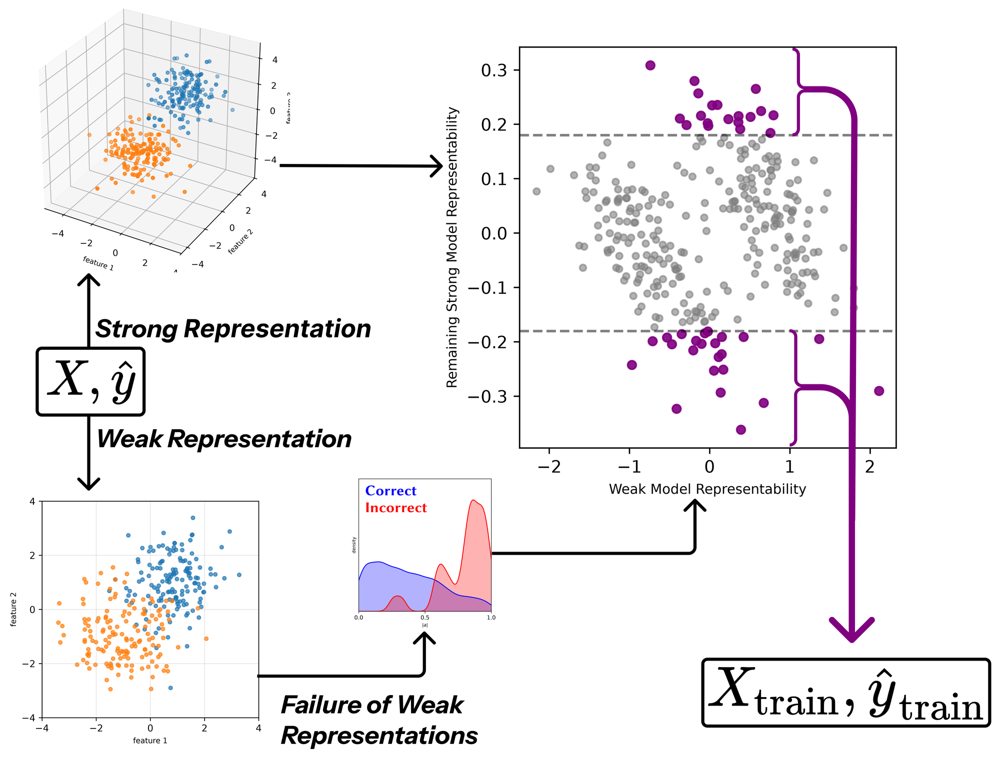

# Aligning Prediction Residuals: Representation-Aware Data Selection for Weak-to-Strong Generalization



RADS selects the weakly labeled data that a strong student trains on in weak-to-strong
generalization, without ground-truth labels: it scores each point by how much of its weak label the
strong representation captures but the weak representation misses (Section 3).
`scripts/score_rads.py` implements RADS, and `scripts/score_rads_lin.py` implements RADS-Lin, the
per-sample form of `P_s(I - P_w)ŷ` from Xue et al. (2025,
[arXiv:2502.00620](https://arxiv.org/abs/2502.00620)).

## Installation

```bash
python3 -m venv .venv && source .venv/bin/activate
pip install -r requirements.txt
```

`requirements.txt` pins the training environment (Python 3.11). The weak model is Qwen2.5-0.5B
and the strong model is Qwen2.5-7B; both models and the datasets download from the Hugging Face Hub
on first use, and one 24 GB GPU fits every run.

## Running experiments

Every result of the paper runs with one command:

```bash
bash scripts/reproduce.sh <result> [dataset]    # e.g. bash scripts/reproduce.sh table1 wanli
```

It runs the sweeps behind that result with the settings of Appendix B.1 over three training seeds:

| Result | Command |
| --- | --- |
| Table 1 | `bash scripts/reproduce.sh table1 <dataset>` |
| Table 6 (low bands) | `bash scripts/reproduce.sh table6 <dataset>` |
| Random Selection (five random halves) | `bash scripts/reproduce.sh random <dataset>` |
| Table 7 (RADS variants) | `bash scripts/reproduce.sh table7 <dataset>` |
| Table 9 (Qwen2.5-1.5B as the weak model) | `bash scripts/reproduce.sh table9 <dataset>` |
| Tables 10 and 11 (no weight decay) | `bash scripts/reproduce.sh table10 <dataset>` |
| Figure 1b (ground-truth labels) | `bash scripts/reproduce.sh figure1b` |
| Figures 2 and 8 (data budgets) | `bash scripts/reproduce.sh figure2 <dataset>` |
| Figure 3 and Table 8 (CKA and RADS columns) | `bash scripts/reproduce.sh figure3 <dataset>` |
| Figure 4 (noised labels) | `bash scripts/reproduce.sh figure4` |

The reward modeling experiments of Section 4.4, the example of Section 3.3, the correlation column
of Table 8, Figures 5 to 7, and the plotting code are not included.

## Outputs

Each sweep writes to `results/<result>/<dataset>/` or a subdirectory of it.

## Using RADS on other data

```python
import sys; sys.path.insert(0, "scripts")
from score_rads import mlp_step1_rp_scores
scores = mlp_step1_rp_scores(weak_acts, strong_acts, weak_labels)
```

`weak_acts` and `strong_acts` hold the representations of the two models for the same points
(arrays of shape [n, d]), and `weak_labels` holds the binary weak labels.

## Repository guide

Each `scripts/score_*.py` file holds one selection method and its variants; Weak Confidence and kNN
are computed in the driver, `scripts/run_w2s_lora.py`.

## License

MIT, see `LICENSE`.
